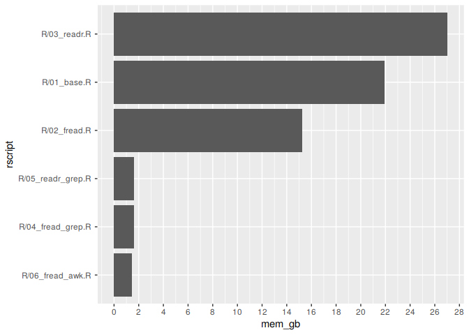
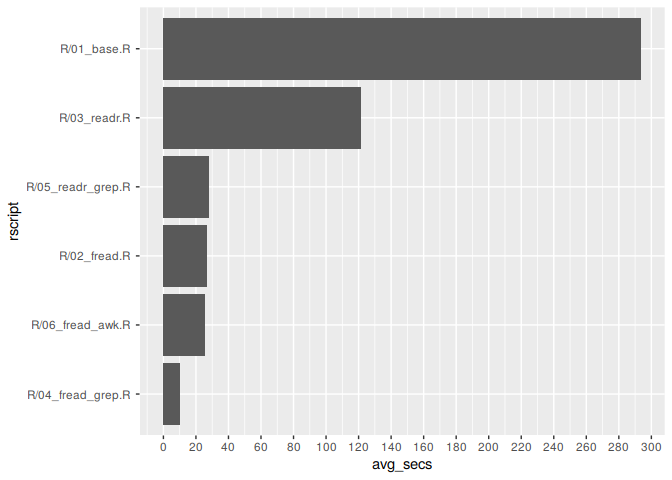

<!-- README.md is generated from README.Rmd. Please edit that file -->

# fread-benchmarks-rsuite

<!-- badges: start -->

<!-- badges: end -->

## Introduction

This is the `rsuite` version of the original tests published by [Jozef
Hajnala](https://gitlab.com/jozefhajnala) in
[Gitlab](https://gitlab.com/jozefhajnala/fread-benchmarks/tree/master).

It is conceptually the same scripts but adding these changes:

1.  a new R script using `awk`: `06_fread_awk.R`
2.  modification of the project structure using the `rsuite` paradigm
3.  addition of comments on scripts
4.  generation of results dataframe: `show_results.R`
5.  plots for memory and average time per operation
6.  packages are all installed exclusively for this project, under the
    folder `packages`, insulated from the global environment

## Data

The data is the same used in the original project (airlines), CSV files
located [here](http://stat-computing.org/dataexpo/2009/the-data.html).
The files are downloaded compressed as bunzip, then expanded as `csv`.

## Running the benchmarks

### For base R

    bash bench.sh R/01_base.R &> results/out_base.txt

### For data.table::fread

    bash bench.sh R/02_fread.R &> results/out_fread.txt

### For readr::read\_csv

    bash bench.sh R/03_readr.R &> results/out_readr.txt

### For data.table::fread with grep

    bash bench.sh R/04_fread_grep.R &> results/out_fread_grep.txt

### For readr::read\_csv with grep

    bash bench.sh R/05_readr_grep.R &> results/out_readr_grep.txt

### For data.table::fread with awk

    bash bench.sh R/06_fread_awk.R &> results/out_fread_awk.txt

## Results

### Tables

``` r
library(dplyr)

source("R/show_results.R")

df <- get_results_df() %>% 
    arrange(-mem_gb) %>% 
    select(result_file, rscript, mem_gb, avg_secs) %>% 
    mutate_if(is.numeric, round, digits = 2) %>% 
    print()
#>          result_file            rscript mem_gb avg_secs
#> 1      out_readr.txt      R/03_readr.R   27.01   121.57
#> 2       out_base.txt       R/01_base.R   21.93   293.52
#> 3      out_fread.txt      R/02_fread.R   15.24    26.86
#> 4 out_readr_grep.txt R/05_readr_grep.R    1.64    28.19
#> 5 out_fread_grep.txt R/04_fread_grep.R    1.62    10.01
#> 6  out_fread_awk.txt  R/06_fread_awk.R    1.47    25.60
```

This is the same table but including the original description for the
scripts.

    #>                               description            rscript mem_gb
    #> 1     `readr::read_csv` + `purrr:map_dfr`      R/03_readr.R   27.01
    #> 2       `utils::read.csv` + `base::rbind`       R/01_base.R   21.93
    #> 3       `data.table::fread` + `rbindlist`      R/02_fread.R   15.24
    #> 4 `readr::read_csv`+ `pipe()` from `grep` R/05_readr_grep.R    1.64
    #> 5         `data.table::fread` from `grep` R/04_fread_grep.R    1.62
    #> 6          `data.table::fread` from `awk`  R/06_fread_awk.R    1.47
    #>   avg_secs
    #> 1   121.57
    #> 2   293.52
    #> 3    26.86
    #> 4    28.19
    #> 5    10.01
    #> 6    25.60

  - mem\_gb = Maximum resident set size, gigabytes
  - avg\_secs = Average of real time and user time as measured by
    `time`, seconds

### Memory required (GB)

``` r
library(ggplot2)
library(scales)

df$rscript <- reorder(df$rscript, df$mem_gb)
ggplot(df, aes(x = rscript, y = mem_gb)) +
    geom_col() +
    scale_y_continuous(breaks=pretty_breaks(n=20)) +
    coord_flip() 
```

<!-- -->

### Average Time (seconds)

``` r
df$rscript <- reorder(df$rscript, df$avg_secs)
ggplot(df, aes(x = rscript, y = avg_secs)) +
    geom_col() +
    scale_y_continuous(breaks=pretty_breaks(n=20)) +
    coord_flip()
```

<!-- -->

## How to reproduce this project yourself

1.  Download and install the [RSuite
    client](https://rsuite.io/RSuite_Download.php). Available for Linux,
    Mac and Windows.
2.  Install the `rsuite` package with `rsuite install`
3.  Clone or download this repository.
4.  Change to this repo folder and install the dependencies on its own
    isolated reproducible environment. Use `rsuite proj depsinst`
5.  Build the project with `rsuite proj build`
6.  Download the data running this from the console `Rscript
    R/data_prep.R`
7.  Run each of the tests. Example: `bash bench.sh R/01_base.R &>
    results/out_base.txt`. See above for the rest.
8.  Generate a comparative table with the results running `Rscript
    R/show_results.R`

## References

  - Original article by [Jozef
    Hajnala](https://twitter.com/jozefhajnala): [How data.table’s fread
    can save you a lot of time and memory, and take input from shell
    commands](https://jozef.io/r917-fread-comparisons/)

  - Original repository:
    <https://gitlab.com/jozefhajnala/fread-benchmarks>

  - Article by [Nick Strayer](https://twitter.com/NicholasStrayer):
    [Using AWK and R to
    parse 25tb](https://livefreeordichotomize.com/2019/06/04/using_awk_and_r_to_parse_25tb/)

  - This [repository]() by [Alfonso R.
    Reyes](https://twitter.com/OilGains)

  - [Rsuite client](https://rsuite.io/)
